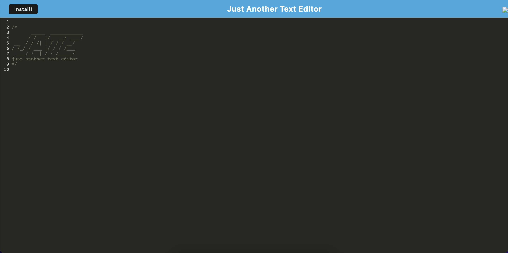

# Text-Editor

This is a project for my UCSD Coding Bootcamp extension.

## Description

`Your task is to build a text editor that runs in the browser. The app will be a single-page application that meets the PWA criteria. Additionally, it will feature a number of data persistence techniques that serve as redundancy in case one of the options is not supported by the browser. The application will also function offline.
To build this text editor, you will start with an existing application and implement methods for getting and storing data to an IndexedDB database. You will use a package called idb, which is a lightweight wrapper around the IndexedDB API. It features a number of methods that are useful for storing and retrieving data, and is used by companies like Google and Mozilla.`

## Preview & Repository

- [GitHub Repo](https://github.com/latommyla/Text-Editor)

## Deployed Appliation

- [View live application!](https://texteditor-hw.herokuapp.com/)

## Installation

Download the application to your local machine or clone the repository. GitHub has instructions on how to do this. After you have it on your local machine follow the steps below.

- In your terminal, type in `npm install` to get al dependencies.
- Then run `npm run build` to build the application.
- Then run `npm run start:dev` to start a server.
- Lastly, in your browser url bar, type in `localhost:3000` to view the live application.

## Contact

- [Portfolio](https://tommymla.com/)
- [LinkedIn](https://www.linkedin.com/in/tommymla/)
- [My Gmail](mailto:tommyl.dmd@gmail.com)
- [GitHub](https://github.com/latommyla)
- [Instagram](https://instagram.com/latommyla)